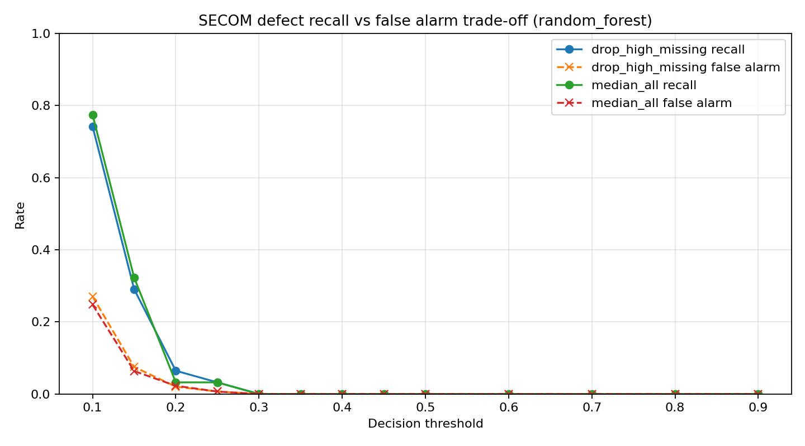

# SECOM 제조 공정 센서 품질 분석 + 8D 리포트

공개 제조 공정 센서 데이터로 pass/fail 품질 판단을 수행하고, 결과를 failure case 조회와 8D report로 정리한 프로젝트다. 단순 정확도가 아니라 불량 미검출(missed defect)과 오경보(false alarm)의 trade-off를 중심으로 본다.

## 문제 정의

제조 현장에서는 정상/불량을 분류하는 정확도만으로 품질 판단을 설명하기 어렵다. 불량을 놓치는 missed defect는 고객 품질 리스크가 되고, 정상 제품을 불량으로 판단하는 false alarm은 재검사와 생산성 저하로 이어진다.

이 프로젝트는 SECOM 반도체 제조 공정 센서 데이터로 다음을 다룬다.

- 결측치와 익명 sensor feature가 많은 데이터에서 pass/fail을 얼마나 안정적으로 예측할 수 있는가.
- accuracy가 아니라 defect recall과 false alarm rate 사이의 trade-off가 어떻게 달라지는가.
- feature importance는 공정 원인 확정이 아니라 추가 점검 후보로만 해석한다.
- 모델 결과를 제조 품질 문법인 8D report로 어떻게 정리하는가.

## 데이터

- 출처: UCI Machine Learning Repository, SECOM Data Set
- URL: https://archive.ics.uci.edu/dataset/179/secom
- 원본 파일: `secom.data`, `secom_labels.data`
- 형태: 1567개 sample, 590개 sensor feature, pass/fail label (defect 104개, defect rate 약 6.6%)
- 제한: feature 이름이 익명화되어 있어 실제 공정 조건이나 설비 원인으로 단정할 수 없다.

## 실행 방법

```bash
cd projects/secom_quality_8d
python3 -m venv .venv
. .venv/bin/activate
pip install -r requirements.txt
python scripts/run_analysis.py
streamlit run app.py
```

선택 실행:

```bash
docker build -t secom-quality-demo .
docker run --rm -p 8501:8501 secom-quality-demo
```

Streamlit 앱은 4개 탭으로 구성된다.

- `Dataset`: sample/feature/defect 비율, 결측 feature 요약.
- `Metrics`: 모델/전처리/threshold별 precision, recall, F1, false alarm, confusion matrix.
- `Failure Cases`: false alarm과 missed defect sample을 threshold에 맞춰 조회.
- `8D Report`: 8D report와 프로젝트 설명.

## 방법

비교 대상은 의도적으로 단순하게 둔다.

1. 결측 처리 전략
   - `median_all`: 모든 feature를 유지하고 median imputation.
   - `drop_high_missing`: 결측률 50% 초과 feature를 제거한 뒤 median imputation.
2. baseline 모델
   - Logistic Regression: 선형 기준선과 threshold 조정 효과 확인.
   - Random Forest: 비선형 feature interaction과 feature importance 후보 확인.
3. 지표
   - defect recall: 불량을 놓치지 않는 정도.
   - false alarm rate: 정상 sample을 불량으로 잘못 보는 비율.
   - precision, F1, balanced accuracy, ROC-AUC.

### 선택 operating point / UI 모델

UI(`app.py`)는 `reports/sample_scores.csv`를 읽는다. `choose_operating_point`가 고른 기준점은 median_all 전략, random_forest, threshold 0.10이며, 이 지점에서 defect recall 0.774, false alarm rate 0.248, missed defect 7이다. accuracy 단독이 아니라 미검출과 오경보 trade-off로 기준점을 정한다.

이 값은 단일 70/30 split 기준이다. threshold를 test set에서 고른 데 따른 낙관 편향이 있을 수 있어, 누수를 제거한 repeated nested CV로도 검증했다(`scripts/rigor.py`). 같은 threshold 0.10에서 nested-CV recall은 0.667(95% CI 0.524-0.793)로 단일 split의 0.774를 포함한다. operating point는 고정 상수가 아니라 비용과 표본에 민감하므로 CI와 함께 보는 것이 정직하다. 자세한 내용은 `reports/rigor_summary.md`에 있다.



## 검증

```bash
cd projects/secom_quality_8d
python scripts/run_analysis.py
python scripts/validate_outputs.py   # 핵심 산출물 존재/비어있지 않음 확인
```

`validate_outputs.py`는 metrics, threshold_tradeoff, sample_scores, 8d_report, threshold 그림 등 핵심 산출물이 생성됐는지 점검하고, 빠진 항목이 있으면 0이 아닌 코드로 종료한다.

## 산출물

| 파일 | 목적 |
| --- | --- |
| `reports/data_profile.csv` | sample 수, feature 수, label imbalance, 결측률 요약 |
| `reports/metrics.csv` | 결측 처리 전략 2개와 baseline 모델 2개의 성능표 |
| `reports/threshold_tradeoff.csv` | threshold별 defect recall, false alarm rate, missed defect 변화 |
| `reports/sample_scores.csv` | Streamlit threshold 조정용 test sample별 defect score |
| `reports/top_features.csv` | feature importance 상위 후보. 원인 확정이 아니라 점검 후보 |
| `reports/error_cases.csv` | false alarm / missed defect sample 목록 |
| `reports/8d_report.md` | 제조 품질 형식의 1장 8D report |
| `reports/rigor_summary.md` | nested CV, DeLong 등 통계적 검증 요약 |
| `reports/figures/threshold_tradeoff.png` | recall과 false alarm trade-off 시각화 |
| `app.py` | 결과 조회용 Streamlit UI |
| `Dockerfile` | Streamlit 데모 컨테이너 실행 옵션 |
